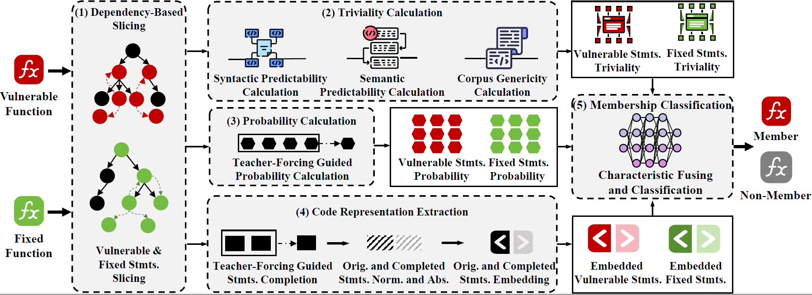
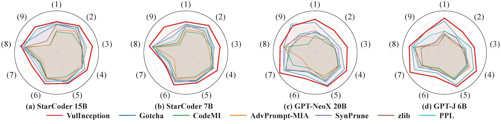

# VulInception: Vulnerability Membership Inference for LLMs


**VulInception** is a novel vulnerability membership inference approach that integrates static analysis with triviality-aware LLM characterization. Specifically, it employs dependency-based slicing to extract vulnerability-relevant statements from the vulnerable function, quantifies statement triviality to calibrate memorization characteristics against trivial coding patterns, and performs vulnerability-aware statement-wise teacher-forcing completion to elicit genuine memorization while mitigating error accumulation. A dual-branch classifier then fuses the triviality-calibrated characteristics to infer membership.

## Project Structure
* `code/`: Core implementation of **VulInception**.
  * `code/step1_slicing/`: Slicing vulnerable function (Corresponding to section 3.2).
  * `code/step2_triviality/`: Compute triviality of statements (Corresponding to section 3.3).
  * `code/step3_probability_respresentation/`: Compute probability and representation of statements (Corresponding to section 3.4&3.5).
  * `code/step4_classification/`: Classify membership of statements (Corresponding to section 3.6).
* `benchmark/`: Our benchmark **VMI-Bench**.
* `result/`: Detailed data and results of RQ1-4.
  * `result/RQ*/*.csv`: Overall results of RQ1-4.
  * `result/RQ*/detailed_output/`: Intermediate results and final membership inference outcomes of VulInception
* `figs/`: Figures.
* `requirements.txt`: Project dependencies.

## Baselines
* [CodeMI](https://github.com/CGCL-codes/naturalcc/tree/main/examples/code-membership-inference): Does your neural code completion model use my code? a membership inference approach. 
* [AdvPrompt-MIA](https://github.com/YuanJiangGit/MIA_Adv):    Effective Code Membership Inference for Code Completion Models via Adversarial Prompts. 
* [Gotcha](https://github.com/yangzhou6666/MIA-LLM4Code): Gotcha! this model uses my code! evaluating membership leakage risks in code models. 
* [SynPrune](https://anonymous.4open.science/r/SYNPRUNE-FED7/): Uncovering Pretraining Code in LLMs: A Syntax-Aware Attribution Approach. 
* [zlib](https://github.com/ftramer/LM_Memorization): Extracting training data from large language models. 
* [PPL](https://github.com/ftramer/LM_Memorization): Extracting training data from large language models.

## Usage
1. **Clone the repository**

2. **Install dependencies**:Ensure you have Python 3.10+
```bash
pip install -r requirements.txt
```

3. **Start vllm server**:
```bash
vllm serve path/to/model --port YOUR_PORT  --return-tokens-as-token-ids --max-logprobs 300 
```

4. **Run step1 slicing**:
```bash
python code/step1_slicing/process_yaml.py \
  -i benchmark/stack.yaml \
  -o path/save/sliced_result.yaml \
  -e path/save/sliced_error.yaml \
  -n 16
```

5. **Run step2 triviality**:
```bash
python code/step2_triviality/compute_triviality.py \
  --input benchmark/stack.yaml --output path/save/weights.jsonl \
  --tokenizer path/to/model --cache df_stats.pkl --data-dir path/to/py_corpus
```

6. **Run step3 probability&representation**:
```bash
python code/step3_probability_respresentation/infer.py --config code/step3_probability_respresentation/config_example.yaml
```

7. **Run step4 classification**:
```bash
python code/step4_classification/train.py \
  --input inference_output.jsonl \
  --embedding-model path/to/unixcoder-base
```

## Evaluation Results

We evaluated **VulInception** on **VMI-bench**, a dataset of 922 CVEs and 1,956 pairs
of vulnerable and fixed function.

### RQ1 Effectiveness Evaluation

We evaluated the effectiveness of **VulInception** and SOTA CMI approches across four LLMs. 

**Table 1 : Effectiveness of vulnerability membership inference approaches across target LLMs**

| Model | Approach | Precision | Recall | F1 |
| --- | --- | --- | --- | --- |
| StarCoder 15B | CodeMI | 0.4224 | 1.0000 | 0.5939 |
| StarCoder 15B | AdvPrompt-MIA | 0.4810 | 0.8790 | 0.6217 |
| StarCoder 15B | Gotcha | 0.7407 | 0.6914 | 0.7152 |
| StarCoder 15B | SynPrune | 0.6903 | 0.7821 | 0.7333 |
| StarCoder 15B | zlib | 0.6739 | 0.7095 | 0.6912 |
| StarCoder 15B | PPL | 0.6680 | 0.7791 | 0.7193 |
| StarCoder 15B | VulInception | 0.7857 | 0.8154 | 0.8003 |
| StarCoder 7B | CodeMI | 0.4224 | 1.0000 | 0.5939 |
| StarCoder 7B | AdvPrompt-MIA | 0.4752 | 0.8699 | 0.6146 |
| StarCoder 7B | Gotcha | 0.7315 | 0.6717 | 0.7003 |
| StarCoder 7B | SynPrune | 0.6535 | 0.8018 | 0.7201 |
| StarCoder 7B | zlib | 0.6244 | 0.7670 | 0.6884 |
| StarCoder 7B | PPL | 0.6192 | 0.8411 | 0.7133 |
| StarCoder 7B | VulInception | 0.7750 | 0.8336 | 0.8032 |
| GPT-Neox 20B | CodeMI | 0.3379 | 0.9924 | 0.5041 |
| GPT-Neox 20B | AdvPrompt-MIA | 0.4205 | 0.6095 | 0.4977 |
| GPT-Neox 20B | Gotcha | 0.7403 | 0.7276 | 0.7339 |
| GPT-Neox 20B | SynPrune | 0.4898 | 0.7810 | 0.6021 |
| GPT-Neox 20B | zlib | 0.4571 | 0.7619 | 0.5714 |
| GPT-Neox 20B | PPL | 0.5262 | 0.6686 | 0.5889 |
| GPT-Neox 20B | VulInception | 0.8126 | 0.8095 | 0.8111 |
| GPT-J 6B | CodeMI | 0.3361 | 1.0000 | 0.5031 |
| GPT-J 6B | AdvPrompt-MIA | 0.3667 | 0.9010 | 0.5212 |
| GPT-J 6B | Gotcha | 0.7920 | 0.6819 | 0.7329 |
| GPT-J 6B | SynPrune | 0.3808 | 0.9162 | 0.5380 |
| GPT-J 6B | zlib | 0.4549 | 0.7105 | 0.5546 |
| GPT-J 6B | PPL | 0.4796 | 0.7371 | 0.5811 |
| GPT-J 6B | VulInception | 0.8234 | 0.7905 | 0.8066 |

We also compute AUC-ROC for all RQ1 approaches.

**Table 2 : AUC-ROC of vulnerability membership inference approaches across target LLMs**

| Approach | StarCoder 15B | StarCoder 7B | GPT-NeoX 20B | GPT-J 6B | Average |
| --- | --- | --- | --- | --- | --- |
| CodeMI | 0.5421 | 0.5288 | 0.5092 | 0.4140 | 0.4985 |
| AdvPrompt-MIA | 0.5143 | 0.4771 | 0.3557 | 0.4056 | 0.4382 |
| Gotcha | 0.8222 | 0.8248 | 0.8497 | 0.8389 | 0.8339 |
| SynPrune | 0.7577 | 0.7492 | 0.6162 | 0.6016 | 0.6812 |
| zlib | 0.6695 | 0.6573 | 0.4337 | 0.3553 | 0.5290 |
| PPL | 0.7646 | 0.7446 | 0.5756 | 0.5956 | 0.6701 |
| VulInception | 0.8633 | 0.8599 | 0.8611 | 0.8683 | 0.8632 |

We further examine whether the training-data membership of the fixed function affects inference quality. Specifically, we split samples into two groups based on whether the fixed counterpart appears in the target model's training data (Fix=0 vs. Fix=1). 

**Table 3 : Effectiveness conditioned on the fixed function’s training-data membership**

| Model | Approach (Fix membership type) | Precision | Recall | F1 |
| --- | --- | --- | --- | --- |
| StarCoder 15B | CodeMI(Fix=0) | 0.3795 | 1 | 0.5502 |
| StarCoder 15B | AdvPrompt-MIA(Fix=0) | 0.4322 | 0.8734 | 0.5782 |
| StarCoder 15B | Gotcha(Fix=0) | 0.6953 | 0.675 | 0.685 |
| StarCoder 15B | SynPrune(Fix=0) | 0.6495 | 0.7778 | 0.7079 |
| StarCoder 15B | zlib(Fix=0) | 0.6269 | 0.7 | 0.6614 |
| StarCoder 15B | PPL(Fix=0) | 0.6199 | 0.7819 | 0.6915 |
| StarCoder 15B | VulInception(Fix=0) | 0.7594 | 0.8093 | 0.7836 |
| StarCoder 15B | CodeMI(Fix=1) | 0.5918 | 1 | 0.7435 |
| StarCoder 15B | AdvPrompt-MIA(Fix=1) | 0.668 | 0.893 | 0.7643 |
| StarCoder 15B | Gotcha(Fix=1) | 0.8808 | 0.7348 | 0.8012 |
| StarCoder 15B | SynPrune(Fix=1) | 0.8323 | 0.7943 | 0.8129 |
| StarCoder 15B | zlib(Fix=1) | 0.8313 | 0.7348 | 0.7801 |
| StarCoder 15B | PPL(Fix=1) | 0.8544 | 0.7714 | 0.8108 |
| StarCoder 15B | VulInception(Fix=1) | 0.8579 | 0.8307 | 0.8441 |
| StarCoder 7B | CodeMI(Fix=0) | 0.3795 | 1 | 0.5502 |
| StarCoder 7B | AdvPrompt-MIA(Fix=0) | 0.4307 | 0.8586 | 0.5736 |
| StarCoder 7B | Gotcha(Fix=0) | 0.6782 | 0.6542 | 0.666 |
| StarCoder 7B | SynPrune(Fix=0) | 0.605 | 0.8042 | 0.6905 |
| StarCoder 7B | zlib(Fix=0) | 0.5735 | 0.7562 | 0.6523 |
| StarCoder 7B | PPL(Fix=0) | 0.5647 | 0.8458 | 0.6772 |
| StarCoder 7B | VulInception(Fix=0) | 0.7548 | 0.8249 | 0.7883 |
| StarCoder 7B | CodeMI(Fix=1) | 0.5918 | 1 | 0.7435 |
| StarCoder 7B | AdvPrompt-MIA(Fix=1) | 0.634 | 0.8984 | 0.7434 |
| StarCoder 7B | Gotcha(Fix=1) | 0.9028 | 0.7182 | 0.8 |
| StarCoder 7B | SynPrune(Fix=1) | 0.8324 | 0.7956 | 0.8136 |
| StarCoder 7B | zlib(Fix=1) | 0.8045 | 0.7956 | 0.8 |
| StarCoder 7B | PPL(Fix=1) | 0.838 | 0.8287 | 0.8333 |
| StarCoder 7B | VulInception(Fix=1) | 0.829 | 0.8556 | 0.8421 |
| GPT-Neox 20B | CodeMI(Fix=0) | 0.2939 | 0.992 | 0.4535 |
| GPT-Neox 20B | AdvPrompt-MIA(Fix=0) | 0.3662 | 0.5426 | 0.4373 |
| GPT-Neox 20B | Gotcha(Fix=0) | 0.6888 | 0.7135 | 0.7009 |
| GPT-Neox 20B | SynPrune(Fix=0) | 0.4211 | 0.7692 | 0.5442 |
| GPT-Neox 20B | zlib(Fix=0) | 0.3852 | 0.7438 | 0.5075 |
| GPT-Neox 20B | PPL(Fix=0) | 0.4556 | 0.6364 | 0.531 |
| GPT-Neox 20B | VulInception(Fix=0) | 0.7696 | 0.7903 | 0.7798 |
| GPT-Neox 20B | CodeMI(Fix=1) | 0.5421 | 0.9933 | 0.7014 |
| GPT-Neox 20B | AdvPrompt-MIA(Fix=1) | 0.5686 | 0.7785 | 0.6572 |
| GPT-Neox 20B | Gotcha(Fix=1) | 0.8786 | 0.7593 | 0.8146 |
| GPT-Neox 20B | SynPrune(Fix=1) | 0.7558 | 0.8075 | 0.7808 |
| GPT-Neox 20B | zlib(Fix=1) | 0.7471 | 0.8025 | 0.7738 |
| GPT-Neox 20B | PPL(Fix=1) | 0.75 | 0.7407 | 0.7453 |
| GPT-Neox 20B | VulInception(Fix=1) | 0.9291 | 0.8562 | 0.8912 |
| GPT-J 6B | CodeMI(Fix=0) | 0.2917 | 1 | 0.4517 |
| GPT-J 6B | AdvPrompt-MIA(Fix=0) | 0.3173 | 0.8936 | 0.4683 |
| GPT-J 6B | Gotcha(Fix=0) | 0.7438 | 0.6639 | 0.7016 |
| GPT-J 6B | SynPrune(Fix=0) | 0.3271 | 0.9229 | 0.4831 |
| GPT-J 6B | zlib(Fix=0) | 0.3852 | 0.7025 | 0.4976 |
| GPT-J 6B | PPL(Fix=0) | 0.4154 | 0.7353 | 0.5309 |
| GPT-J 6B | VulInception(Fix=0) | 0.7879 | 0.7688 | 0.7782 |
| GPT-J 6B | CodeMI(Fix=1) | 0.5458 | 1 | 0.7062 |
| GPT-J 6B | AdvPrompt-MIA(Fix=1) | 0.5931 | 0.9195 | 0.7211 |
| GPT-J 6B | Gotcha(Fix=1) | 0.9141 | 0.7222 | 0.8069 |
| GPT-J 6B | SynPrune(Fix=1) | 0.6109 | 0.9012 | 0.7282 |
| GPT-J 6B | zlib(Fix=1) | 0.7468 | 0.7284 | 0.7375 |
| GPT-J 6B | PPL(Fix=1) | 0.7724 | 0.7417 | 0.7568 |
| GPT-J 6B | VulInception(Fix=1) | 0.9149 | 0.8431 | 0.8776 |

We also evaluate the effectiveness of **VulInception** under different vulnerability types. Detailed results are shown in [this file](result/RQ1_effectiveness/vulnerability_types.csv).

**Figure 1 : Effectiveness conditioned on the different vulnerability type**



> VulInception consistently outperforms all baselines on all four target models, achieving an F1 of 0.80–0.81 and outperforming the best baseline by an average of 11%.

---

### RQ2 Ablation Study

We conduct an ablation study to investigate the contribution of each component of **VulInception**.

**Table 4 : Ablation Study of VulInception**

| Model | Method | Precision | Recall | F1 |
| --- | --- | --- | --- | --- |
| StarCoder 15B | Ours Ablation Probs | 0.7023 | 0.7458 | 0.7234 |
| StarCoder 15B | Ours Ablation Representation | 0.5358 | 0.5779 | 0.556 |
| StarCoder 15B | Ours Ablation Triviality | 0.6986 | 0.7504 | 0.7236 |
| StarCoder 15B | Ours Ablation SynPred | 0.7340 | 0.7640 | 0.7487 |
| StarCoder 15B | Ours Ablation SemPred | 0.7664 | 0.7247 | 0.7449 |
| StarCoder 15B | Ours Ablation CorpusGen | 0.7626 | 0.7337 | 0.7479 |
| StarCoder 15B | Ours Min Aggregation | 0.7558 | 0.7443 | 0.7500 |
| StarCoder 15B | Ours Avg Aggregation | 0.7352 | 0.7519 | 0.7435 |
| StarCoder 15B | Ours Ablation Slicing | 0.7715 | 0.7458 | 0.7585 |
| StarCoder 15B | Ours | 0.7857 | 0.8154 | 0.8003 |
| StarCoder 15B | Ours Ablation Probs Delta | -0.0834 | -0.0696 | -0.0769 |
| StarCoder 15B | Ours Ablation Representation Delta | -0.2499 | -0.2375 | -0.2443 |
| StarCoder 15B | Ours Ablation Triviality Delta | -0.0871 | -0.065 | -0.0767 |
| StarCoder 15B | Ours Ablation SynPred Delta | -0.0517 | -0.0514 | -0.0516 |
| StarCoder 15B | Ours Ablation SemPred Delta | -0.0193 | -0.0907 | -0.0554 |
| StarCoder 15B | Ours Ablation CorpusGen Delta | -0.0231 | -0.0817 | -0.0524 |
| StarCoder 15B | Ours Min Aggregation Delta | -0.0299 | -0.0711 | -0.0503 |
| StarCoder 15B | Ours Avg Aggregation Delta | -0.0505 | -0.0635 | -0.0568 |
| StarCoder 15B | Ours Ablation Slicing Delta | -0.0142 | -0.0696 | -0.0418 |
| StarCoder 7B | Ours Ablation Probs | 0.6714 | 0.7852 | 0.7238 |
| StarCoder 7B | Ours Ablation Representation | 0.5374 | 0.5658 | 0.5512 |
| StarCoder 7B | Ours Ablation Triviality | 0.6853 | 0.7247 | 0.7044 |
| StarCoder 7B | Ours Ablation SynPred | 0.7558 | 0.7352 | 0.7454 |
| StarCoder 7B | Ours Ablation SemPred | 0.7575 | 0.7277 | 0.7423 |
| StarCoder 7B | Ours Ablation CorpusGen | 0.7732 | 0.7322 | 0.7521 |
| StarCoder 7B | Ours Min Aggregation | 0.7390 | 0.7368 | 0.7379 |
| StarCoder 7B | Ours Avg Aggregation | 0.7430 | 0.7216 | 0.7322 |
| StarCoder 7B | Ours Ablation Slicing | 0.7799 | 0.7398 | 0.7593 |
| StarCoder 7B | Ours | 0.775 | 0.8336 | 0.8032 |
| StarCoder 7B | Ours Ablation Probs Delta | -0.1036 | -0.0484 | -0.0794 |
| StarCoder 7B | Ours Ablation Representation Delta | -0.2376 | -0.2678 | -0.252 |
| StarCoder 7B | Ours Ablation Triviality Delta | -0.0897 | -0.1089 | -0.0988 |
| StarCoder 7B | Ours Ablation SynPred Delta | -0.0192 | -0.0984 | -0.0578 |
| StarCoder 7B | Ours Ablation SemPred Delta | -0.0175 | -0.1059 | -0.0609 |
| StarCoder 7B | Ours Ablation CorpusGen Delta | -0.0018 | -0.1014 | -0.0511 |
| StarCoder 7B | Ours Min Aggregation Delta | -0.0360 | -0.0968 | -0.0653 |
| StarCoder 7B | Ours Avg Aggregation Delta | -0.0320 | -0.1120 | -0.0710 |
| StarCoder 7B | Ours Ablation Slicing Delta | 0.0049 | -0.0938 | -0.0439 |
| GPT-Neox 20B | Ours Ablation Probs | 0.7813 | 0.7486 | 0.7646 |
| GPT-Neox 20B | Ours Ablation Representation | 0.4158 | 0.541 | 0.4702 |
| GPT-Neox 20B | Ours Ablation Triviality | 0.6707 | 0.741 | 0.7041 |
| GPT-Neox 20B | Ours Ablation SynPred | 0.8166 | 0.7295 | 0.7706 |
| GPT-Neox 20B | Ours Ablation SemPred | 0.7890 | 0.7124 | 0.7487 |
| GPT-Neox 20B | Ours Ablation CorpusGen | 0.7992 | 0.7352 | 0.7659 |
| GPT-Neox 20B | Ours Min Aggregation | 0.7706 | 0.7486 | 0.7594 |
| GPT-Neox 20B | Ours Avg Aggregation | 0.8043 | 0.7124 | 0.7556 |
| GPT-Neox 20B | Ours Ablation Slicing | 0.7519 | 0.7733 | 0.7624 |
| GPT-Neox 20B | Ours | 0.8126 | 0.8095 | 0.8111 |
| GPT-Neox 20B | Ours Ablation Probs Delta | -0.0313 | -0.0609 | -0.0465 |
| GPT-Neox 20B | Ours Ablation Representation Delta | -0.3968 | -0.2685 | -0.3409 |
| GPT-Neox 20B | Ours Ablation Triviality Delta | -0.1419 | -0.0685 | -0.107 |
| GPT-Neox 20B | Ours Ablation SynPred Delta | 0.0040 | -0.0800 | -0.0405 |
| GPT-Neox 20B | Ours Ablation SemPred Delta | -0.0236 | -0.0971 | -0.0624 |
| GPT-Neox 20B | Ours Ablation CorpusGen Delta | -0.0134 | -0.0743 | -0.0452 |
| GPT-Neox 20B | Ours Min Aggregation Delta | -0.0420 | -0.0609 | -0.0517 |
| GPT-Neox 20B | Ours Avg Aggregation Delta | -0.0083 | -0.0971 | -0.0555 |
| GPT-Neox 20B | Ours Ablation Slicing Delta | -0.0607 | -0.0362 | -0.0487 |
| GPT-J 6B | Ours Ablation Probs | 0.7579 | 0.7333 | 0.7454 |
| GPT-J 6B | Ours Ablation Representation | 0.4009 | 0.52 | 0.4527 |
| GPT-J 6B | Ours Ablation Triviality | 0.623 | 0.8057 | 0.7027 |
| GPT-J 6B | Ours Ablation SynPred | 0.7919 | 0.7467 | 0.7686 |
| GPT-J 6B | Ours Ablation SemPred | 0.8205 | 0.7486 | 0.7829 |
| GPT-J 6B | Ours Ablation CorpusGen | 0.7874 | 0.7410 | 0.7635 |
| GPT-J 6B | Ours Min Aggregation | 0.8017 | 0.7390 | 0.7691 |
| GPT-J 6B | Ours Avg Aggregation | 0.6927 | 0.7600 | 0.7248 |
| GPT-J 6B | Ours Ablation Slicing | 0.7811 | 0.7543 | 0.7674 |
| GPT-J 6B | Ours | 0.8234 | 0.7905 | 0.8066 |
| GPT-J 6B | Ours Ablation Probs Delta | -0.0655 | -0.0572 | -0.0612 |
| GPT-J 6B | Ours Ablation Representation Delta | -0.4225 | -0.2705 | -0.3539 |
| GPT-J 6B | Ours Ablation Triviality Delta | -0.2004 | 0.0152 | -0.1039 |
| GPT-J 6B | Ours Ablation SynPred Delta | -0.0315 | -0.0438 | -0.0380 |
| GPT-J 6B | Ours Ablation SemPred Delta | -0.0029 | -0.0419 | -0.0237 |
| GPT-J 6B | Ours Ablation CorpusGen Delta | -0.0360 | -0.0495 | -0.0431 |
| GPT-J 6B | Ours Min Aggregation Delta | -0.0217 | -0.0515 | -0.0375 |
| GPT-J 6B | Ours Avg Aggregation Delta | -0.1307 | -0.0305 | -0.0818 |
| GPT-J 6B | Ours Ablation Slicing Delta | -0.0423 | -0.0362 | -0.0392 |

> All components are complementary. Code representation remains the most impactful, followed by triviality calibration; removing SynPred, SemPred, or CorpusGen and changing aggregation also reduces F1 across target models.

---

### RQ3 Sensitivity Analysis

We evaluate the sensitivity of **VulInception** to key hyperparameters: the proportion of known members and the sampling temperature.

**Table 5 : Sensitivity Analysis of VulInception on different proportion of known members**

| Model | Proportion of known members | Precision | Recall | F1 |
| --- | --- | --- | --- | --- |
| StarCoder 15B | 20% | 0.7857 | 0.8154 | 0.8003 |
| StarCoder 15B | 50% | 0.8599 | 0.862 | 0.8609 |
| StarCoder 15B | 80% | 0.8704 | 0.8494 | 0.8598 |
| StarCoder 7B | 20% | 0.775 | 0.8336 | 0.8032 |
| StarCoder 7B | 50% | 0.8482 | 0.8523 | 0.8502 |
| StarCoder 7B | 80% | 0.8861 | 0.8434 | 0.8642 |
| GPT-Neox 20B | 20% | 0.8126 | 0.8095 | 0.8111 |
| GPT-Neox 20B | 50% | 0.8174 | 0.8323 | 0.8248 |
| GPT-Neox 20B | 80% | 0.8661 | 0.8333 | 0.8494 |
| GPT-J 6B | 20% | 0.8234 | 0.7905 | 0.8066 |
| GPT-J 6B | 50% | 0.8383 | 0.8537 | 0.8459 |
| GPT-J 6B | 80% | 0.8862 | 0.8258 | 0.8549 |

**Table 6 : Sensitivity Analysis of VulInception on different sampling temperature**

| Model | Sampling temperature | Precision | Recall | F1 |
| --- | --- | --- | --- | --- |
| StarCoder 15B | 0.0 | 0.7857 | 0.8154 | 0.8003 |
| StarCoder 15B | 0.2 | 0.7902 | 0.8321 | 0.8106 |
| StarCoder 15B | 0.4 | 0.7802 | 0.8109 | 0.7953 |
| StarCoder 15B | 0.6 | 0.7765 | 0.82 | 0.7976 |
| StarCoder 15B | 0.8 | 0.771 | 0.8048 | 0.7876 |
| StarCoder 15B | 1.0 | 0.8009 | 0.8033 | 0.8021 |
| StarCoder 7B | 0.0 | 0.775 | 0.8336 | 0.8032 |
| StarCoder 7B | 0.2 | 0.7776 | 0.8094 | 0.7932 |
| StarCoder 7B | 0.4 | 0.7707 | 0.8185 | 0.7938 |
| StarCoder 7B | 0.6 | 0.7855 | 0.82 | 0.8024 |
| StarCoder 7B | 0.8 | 0.7658 | 0.8411 | 0.8017 |
| StarCoder 7B | 1.0 | 0.7814 | 0.8275 | 0.8038 |
| GPT-Neox 20B | 0.0 | 0.8126 | 0.8095 | 0.8111 |
| GPT-Neox 20B | 0.2 | 0.8891 | 0.7486 | 0.8128 |
| GPT-Neox 20B | 0.4 | 0.8462 | 0.7752 | 0.8091 |
| GPT-Neox 20B | 0.6 | 0.8587 | 0.7638 | 0.8085 |
| GPT-Neox 20B | 0.8 | 0.8544 | 0.76 | 0.8044 |
| GPT-Neox 20B | 1.0 | 0.8195 | 0.7695 | 0.7937 |
| GPT-J 6B | 0.0 | 0.8234 | 0.7905 | 0.8066 |
| GPT-J 6B | 0.2 | 0.8285 | 0.7543 | 0.7896 |
| GPT-J 6B | 0.4 | 0.8426 | 0.7543 | 0.796 |
| GPT-J 6B | 0.6 | 0.8513 | 0.7524 | 0.7988 |
| GPT-J 6B | 0.8 | 0.8489 | 0.76 | 0.802 |
| GPT-J 6B | 1.0 | 0.8309 | 0.7486 | 0.7876 |

> VulInception is robust to both hyperparameters; F1 varies by ≤8% across training data proportions and ≤1% across sampling temperatures.

---

### Additional Efficiency Evaluation

We report the training time and inference time of each approach, averaged across the four target models.

**Table 8 : Efficiency Comparison of MIA Methods**

| Method | Train Time(s) | Inference Time(s) |
| --- | --- | --- |
| Gotcha | 3210.9806 | 16.406 |
| AdvPrompt-MIA | 37974.7764 | 194.119 |
| CodeMI | 100.8874 | 0.509 |
| PPL | 116.637 | 0.51 |
| zlib | 1632.2648 | 8.338 |
| SynPrune | 115.121 | 0.515 |
| VulInception | 2908.8326 | 14.811 |

> VulInception achieves a practical trade-off of effectiveness and efficiency.

### RQ4 Usefulness Analysis
We use PURGE (ICLR'26) to test whether vulnerability members identified by **VulInception** can serve as a precise forget set for reducing vulnerable code generation. We compare against Random, Gotcha, and GT (Oracle), reporting Bandit-based VR on VMI-Bench and unseen CVEs from 2026-01-01 to 2026-05-01, and HumanEval pass@1.

The models obtained by applying PURGE with the corresponding forget sets have been uploaded to Hugging Face:

- [GPT-J-6B / VulInception](https://huggingface.co/mustard-curx/purge-gpt-j-6b-vulinception)
- [GPT-J-6B / Random](https://huggingface.co/mustard-curx/purge-gpt-j-6b-random)
- [GPT-J-6B / Gotcha](https://huggingface.co/mustard-curx/purge-gpt-j-6b-gotcha)
- [GPT-J-6B / Groundtruth](https://huggingface.co/mustard-curx/purge-gpt-j-6b-groundtruth)
- [StarCoderBase-7B / VulInception](https://huggingface.co/mustard-curx/purge-starcoderbase-7b-vulinception)
- [StarCoderBase-7B / Random](https://huggingface.co/mustard-curx/purge-starcoderbase-7b-random)
- [StarCoderBase-7B / Gotcha](https://huggingface.co/mustard-curx/purge-starcoderbase-7b-gotcha)
- [StarCoderBase-7B / Groundtruth](https://huggingface.co/mustard-curx/purge-starcoderbase-7b-groundtruth)

**Table 9 : Unlearning Results with Different Forget-set Selectors**

| Model | Forget-set Selector | VMI-Bench VR | Unseen CVE VR | Pass@1 |
| --- | --- | --- | --- | --- |
| GPT-J 6B | Original | 0.33 | 0.07 | 0.12 |
| GPT-J 6B | Random | 0.27 | 0.06 | 0.10 |
| GPT-J 6B | Gotcha | 0.15 | 0.05 | 0.11 |
| GPT-J 6B | VulInception | 0.11 | 0.04 | 0.10 |
| GPT-J 6B | GT (Oracle) | 0.09 | 0.04 | 0.10 |
| StarCoder 7B | Original | 0.38 | 0.08 | 0.24 |
| StarCoder 7B | Random | 0.31 | 0.08 | 0.21 |
| StarCoder 7B | Gotcha | 0.22 | 0.06 | 0.22 |
| StarCoder 7B | VulInception | 0.17 | 0.05 | 0.20 |
| StarCoder 7B | GT (Oracle) | 0.15 | 0.05 | 0.20 |

> VulInception achieves the lowest VMI-Bench VR among non-oracle selectors and reaches oracle-level VR on unseen CVEs. The small pass@1 changes indicate a favorable unlearning trade-off.
